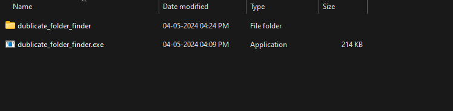
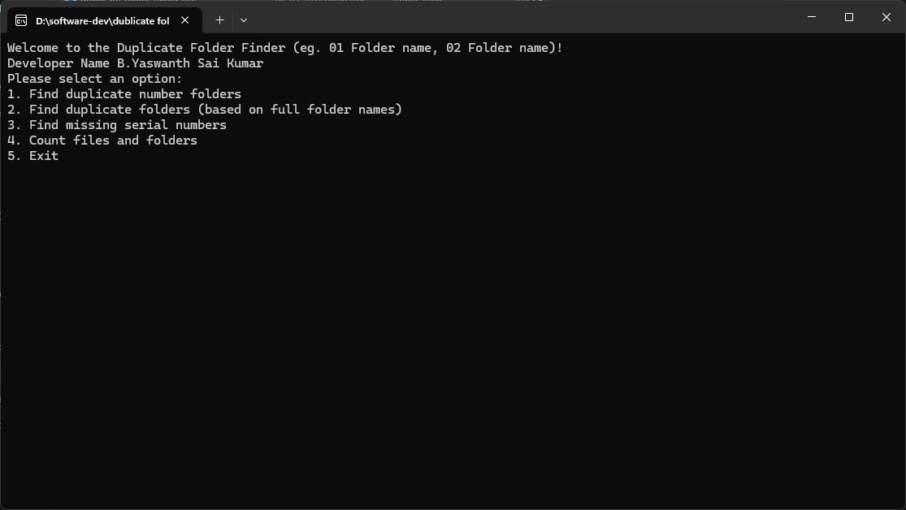
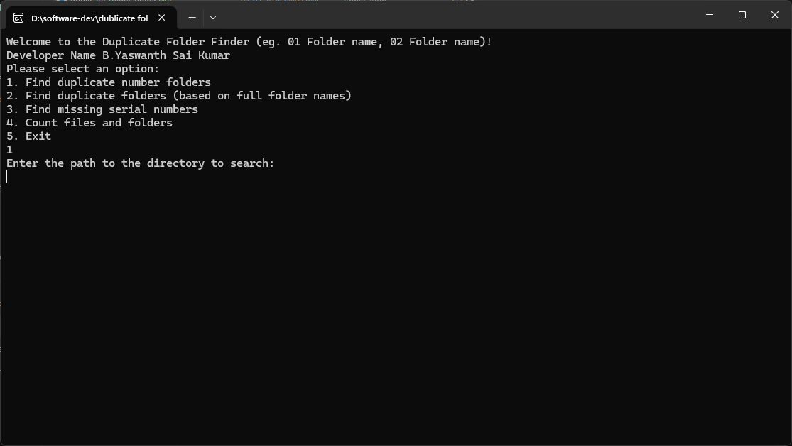

# Duplicate Folder Finder

A simple Rust program to find duplicate folders and missing serial numbers in a directory.

## Table of Contents

- [Overview](#overview)
- [Installation](#installation)
- [Usage](#usage)
- [License](#license)

## Overview

This program provides several functionalities to manage directories:

1. Find duplicate number folders: Identifies folders with duplicate numeric prefixes in their names.
2. Find duplicate folders: Identifies folders with identical names.
3. Find missing serial numbers: Identifies missing serial numbers in the numeric prefixes of folder names.
4. Count files and folders: Counts the number of files and folders in a directory.

## Screen Shorts







## Installation

Ensure you have Rust installed on your system. You can download and install Rust from [here](https://www.rust-lang.org/tools/install).

Clone this repository to your local machine:

```bash
git clone https://github.com/yaswanthsaikumar12/dublicate_folder_finder.git
